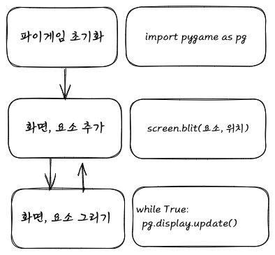

# 파이게임이란?
python을 사용하여 게임을 만드는데 사용하는 오픈소스 라이브러리

# 오픈소스란?
누구나 특별한 제한 없이 자유롭게
사용, 복제, 배포, 수정할 수 있는 소프트웨어.

# 라이브러리란?
필요한 기능들이 모여있는 코드의 묶음.
객체나 함수 등의 형태를 가지고 있다.
개발자가 직접 호출하여 사용한다. 

# 오픈소스 라이브러리?
오픈소스를 기반으로 만들어진 라이브러리.

# 파이게임 동작 방식

```shell
pip install pygame
```
[⚡️무한 반복 안돌리면 어떻게 되는지 알아?](./1-1.py)

